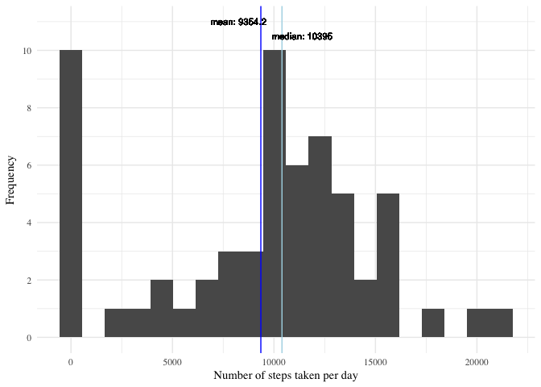
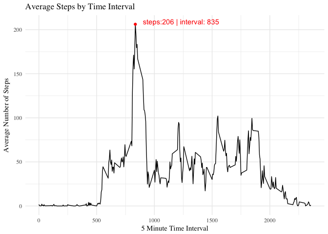
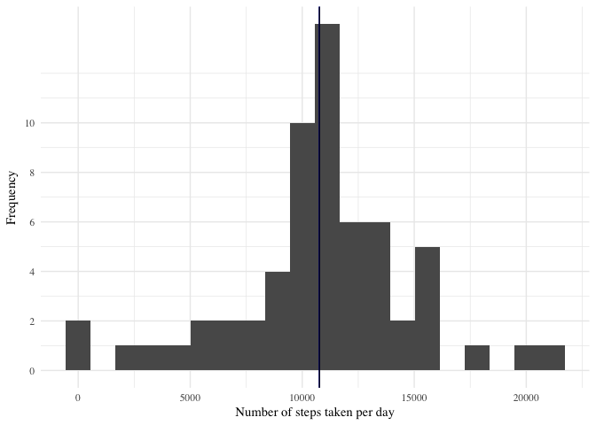
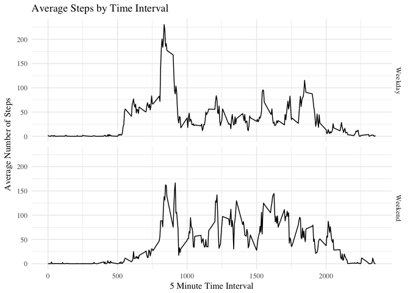

# Reproducible Research: Peer Assessment 1


```r
#set working directory
path <- getwd()
```

## Loading and preprocessing the data


```r
zip <- "activity.zip"
f <- "activity.csv"
activityDt <- read.table(unz(file.path(path, zip), f), sep = ",", header = TRUE)
```


```r
activityDt <- transform(activityDt , date=as.Date(date, format = "%Y-%m-%d"))
```

```
## Warning in strptime(x, format, tz = "GMT"): unknown timezone 'zone/tz/
## 2018e.1.0/zoneinfo/Europe/Stockholm'
```

## What is mean total number of steps taken per day?


```r
daily_total <- activityDt %>% 
    group_by(date) %>% 
    summarise(count = sum(steps, na.rm = T))
```


```r
mean <- mean(daily_total$count)
median <- median(daily_total$count)

ggplot(data = daily_total, aes(daily_total$count)) + 
    geom_histogram(bins = 20) +
    geom_vline(aes(xintercept = mean(daily_total$count), colour = "myline1"), color = "blue", show.legend = TRUE) + 
    geom_vline(xintercept = median(daily_total$count), aes(colour = "myline2"), color = "lightblue") + 
    scale_y_continuous(breaks = seq(0, 10, by = 2)) + 
    xlab("Number of steps taken per day") +
    ylab("Frequency") + 
    geom_text(aes(x=mean(daily_total$count)-1100, 
                  label=paste("mean: ", round(mean(daily_total$count), digits = 1), sep = ""), 
                  y = 11), size = 3) +
    geom_text(aes(x=median(daily_total$count)+1000, 
                  label=paste("median: ", round(median(daily_total$count), digits = 1), sep = ""), 
                  y = 10.5), size = 3) +
    theme_minimal(base_family = "Times") 
```

<!-- -->


## What is the average daily activity pattern?


```r
# Summarize data by intervals
interval_total <- activityDt %>% 
    group_by(interval) %>% 
    summarise(avg_steps = mean(steps, na.rm = T))

# Find Interval That Has The Maximum Avg Steps
max <- interval_total[which.max(interval_total$avg_steps),]
```

1. Make a time series plot (i.e. type = "l") of the 5-minute interval (x-axis) and the average number of steps taken, averaged across all days (y-axis)


```r
#Generate Label for max point 
max_label <- paste("steps:", round(max$avg_steps), " | interval: ", max$interval, sep = "")

#plot the time series
ggplot(data = interval_total, aes(x = interval_total$interval, y = interval_total$avg_steps)) + 
    geom_line() + 
    geom_point(data = max, aes(x = max$interval, y = max$avg_steps), color = "red") + 
    geom_text(aes(label=ifelse(interval_total$avg_steps >= max$avg_steps, as.character(max_label),'')), 
              hjust = -.1, vjust = 0, color = "red") +
    xlab("5 Minute Time Interval") + 
    ylab("Average Number of Steps") + 
    labs(title="Average Steps by Time Interval") + 
    theme_minimal(base_family = "Times")
```

<!-- -->


2. Which 5-minute interval, on average across all the days in the dataset, contains the maximum number of steps?

```r
max[1,]
```

```
## # A tibble: 1 x 2
##   interval avg_steps
##      <int>     <dbl>
## 1      835  206.1698
```

## Imputing missing values

1. Calculate & Report The Number of Missing Values

```r
sum(is.na(activityDt$steps))
```

```
## [1] 2304
```

2. Devise a strategy for filling in all of the missing values in the dataset. The strategy does not need to be sophisticated. For example, you could use the mean/median for that day, or the mean for that 5-minute interval, etc.


```r
na_replace <- function(x, y) {
    if(is.na(x)) {
        return (y)
    }
    return (x)
}
```

3. Create a new dataset that is equal to the original dataset but with the missing data filled in.


```r
# Create new data set by mergin original data set and avg_steps per day data set
activityDf2 <- merge(x = activityDt, y = interval_total, by = "interval", all = TRUE)

# Replace missing values with average in inverval
activityDf2$new_steps <- mapply(na_replace, activityDf2$steps, activityDf2$avg_steps)

# Clean up data set and order columns by date and interval
activityDf2 <- activityDf2 %>% select(interval = interval, date = date, steps = new_steps)
activityDf2 <- activityDf2[with(activityDf2, order(date, interval)), ]
```

4. Make a histogram of the total number of steps taken each day and Calculate and report the mean and median total number of steps taken per day. Do these values differ from the estimates from the first part of the assignment? What is the impact of imputing missing data on the estimates of the total daily number of steps?


```r
daily_total_nm <- activityDf2 %>% 
    group_by(date) %>% 
    summarise(count = sum(steps, na.rm = T))
```


```r
ggplot(data=daily_total_nm, aes(daily_total_nm$count)) + 
    geom_histogram(bins = 20) +
    geom_vline(xintercept = mean(daily_total_nm$count), color = "blue") + 
    geom_vline(xintercept = median(daily_total_nm$count)) + 
    scale_y_continuous(breaks = seq(0, 10, by = 2)) + 
    xlab("Number of steps taken per day") +
    ylab("Frequency") + 
    theme_minimal(base_family = "Times")
```

<!-- -->

**Answer To Question:**
There is not much difference, because methoed used to replace missing values was using mean anyways. Median value is closer to the mean.

## Are there differences in activity patterns between weekdays and weekends?

1. Create a new factor variable in the dataset with two levels – “weekday” and “weekend” indicating whether a given date is a weekday or weekend day.


```r
# Function determinate if day is weekend or weekday 
is.weekend <- function(x) {
    if (weekdays(x) %in% c("Saturday", "Sunday")) {
        return ("Weekend")
    }
    return ("Weekday")
}

activityDf2$daytype <- as.factor(mapply(is.weekend, activityDf2$date))
```

2. Make a panel plot containing a time series plot (i.e. type = "l") of the 5-minute interval (x-axis) and the average number of steps taken, averaged across all weekday days or weekend days (y-axis).


```r
interval_total <- activityDf2 %>% 
    group_by(daytype, interval) %>% 
    summarise(avg_steps = mean(steps, na.rm = T))
```


```r
ggplot(data = interval_total, aes(x = interval_total$interval, y = interval_total$avg_steps)) + 
    geom_line() + 
    facet_grid(daytype ~ .) +
    xlab("5 Minute Time Interval") + 
    ylab("Average Number of Steps") + 
    labs(title="Average Steps by Time Interval") + 
    theme_minimal(base_family = "Times")
```

<!-- -->
    
